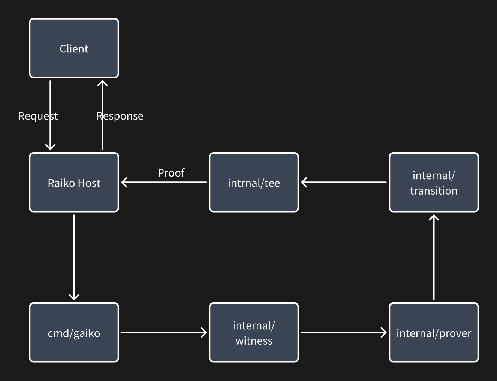

# Gaiko is Golang port of Raiko

## Architecture

```text
$ tree -d
.
├── cmd
│   └── gaiko
├── ego
├── internal
│   ├── flags
│   ├── prover
│   ├── tee
│   ├── transition
│   ├── types
│   ├── version
│   └── witness
├── pkg
│   ├── keccak
│   └── mpt
└── test
    └── fixtures
        ├── batch
        └── single
```

- `cmd/gaiko` `gaiko` cli entry
- `ego` artifacts, e.g. config
- `internal/flags` cli arguments
- `internal/prover` prover abstracts, the core logic of `gaiko`
- `internal/tee` TEE provider, `tdx`, `gramine` or `ego`, compile with `-tags dev` to use `dev` mode
- `internal/transition` state transition of blocks
- `internal/types` type bridge between `raiko` and `gaiko`
- `internal/version` cli version helper
- `internal/witness` proof witness, aka: `Batch/GuestInput` in `raiko`
- `pkg/keccak` pooled keccak hasher
- `pkg/mpt` the golang porting of merkle trie from `raiko`

## Data Flow(Oneshot)



## Build

ego-go build -o gaiko-ego ./cmd/gaiko
ego sign && ego bundle gaiko-ego gaiko
ego uniqueid gaiko-ego
ego signerid gaiko-ego

## Command Help

```text
$ ./gaiko
NAME:
   gaiko - The Gaiko command line interface

USAGE:
   gaiko [global options] command [command options]

VERSION:
   1.15.5-stable

COMMANDS:
   one-shot          Run state transition once
   one-batch-shot    Run multi states transition once
   aggregate         Run the aggregate process
   bootstrap         Run the bootstrap process
   check             Run the check process
   server, serve, s  Start Gaiko HTTP Server
   help, h           Shows a list of commands or help for one command

GLOBAL OPTIONS:
   --help, -h     show help
   --version, -v  print the version

   GLOBAL

   --config-dir value  Directory for configuration files (default: /Users/xus/.config/raiko/config)
   --secret-dir value  Directory for the secret files (default: /Users/xus/.config/raiko/secrets)
   --sgx-type value    Which SGX type? "debug", "ego" or "gramine" [$SGX_TYPE]

   LOGGING

   --log-json         Format logs with JSON (default: false) [$LOG_JSON]
   --verbosity value  Logging verbosity: 0=silent, 1=error, 2=warn, 3=info, 4=debug, 5=detail (default: 3) [$VERBOSITY]


COPYRIGHT:
   Copyright 2025-2025 The Gaiko Authors
```
